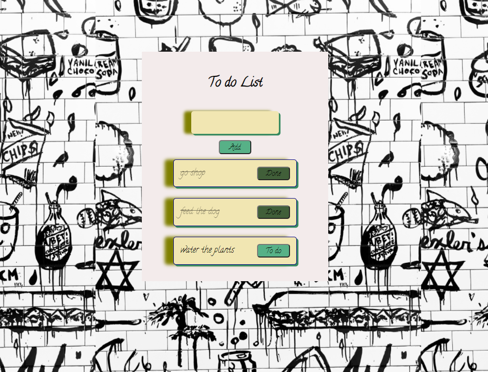

# Todo List

## General Info
Goal of project is to build a Todo List App with React.

## Technologies
* HTML 
* CSS 
* JavaScript
* React

## Screenshots

## Online DEMO
https://anadoh.github.io/to_do_list/

## Setup
How to run this project.
1. Clone this repo
2. npm install
3. npm start 

## Status
Project is finished.

## License
MIT

